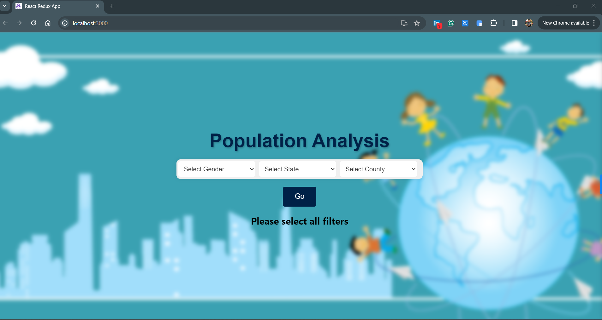
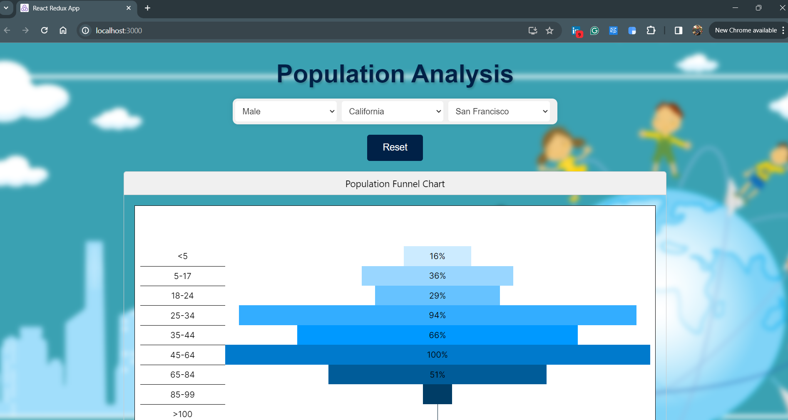
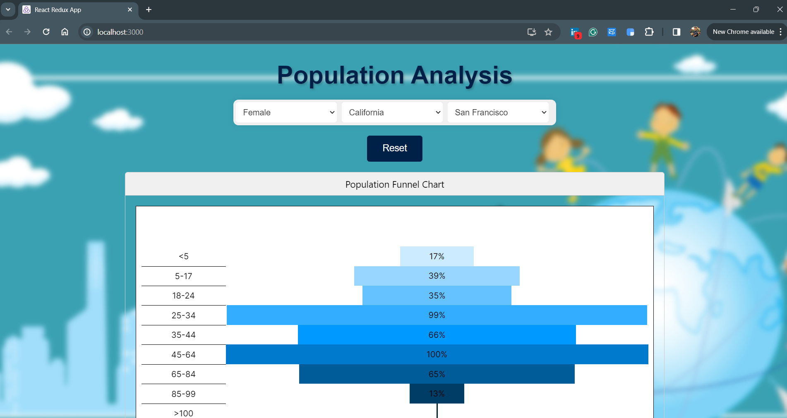

# Getting Started with React and Django App

This project I have implemented frontend using ReactJs and backend using Django. I have made my DB using sqlite and imported the CSV data to sqlite DB.

# How to run Frontend Code
Step 1 : Go to the project directory. Run the npm init command in terminal.
Step 2 : Now run the command 'npm start' to run the react app.

# How to run the backend Code
I have pushed the backend code with the node modules that there were on my machine.
Step 1 : Run the django server using command 'python3 manage.py runserver'.
Step 2 : If any error occurs due to any modules then install that module using npm install. 

# Now in the app 
In the App, you have to select all the three filters. Then the after selecting the filters you will be shown a funnel graph according to the age groups.

You can check the funnel graph for both male and female sex categories.

After you plot a graph using the filters then you should click on the 'Reset' button and then select all the filters again then click on 'Go' button to plot a new graph.

# Demo of my application

